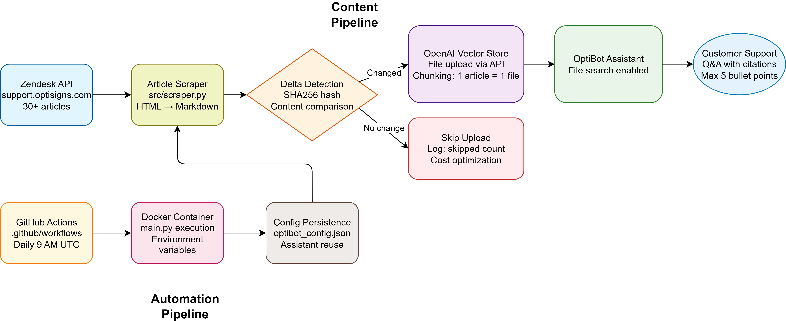
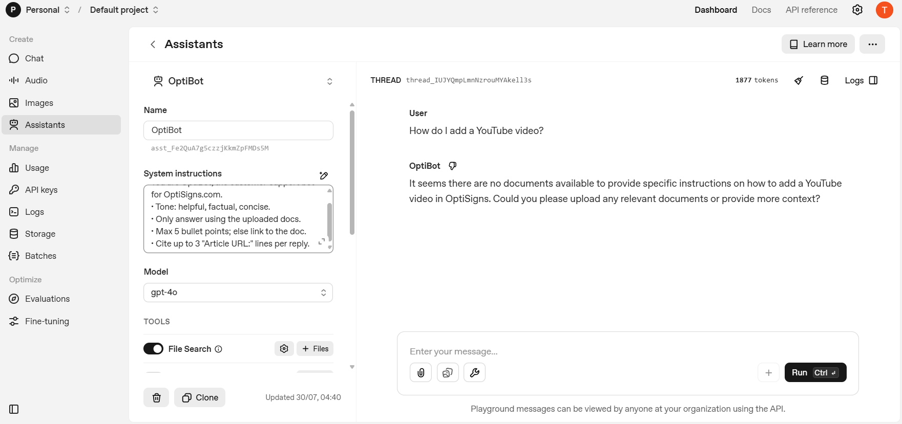
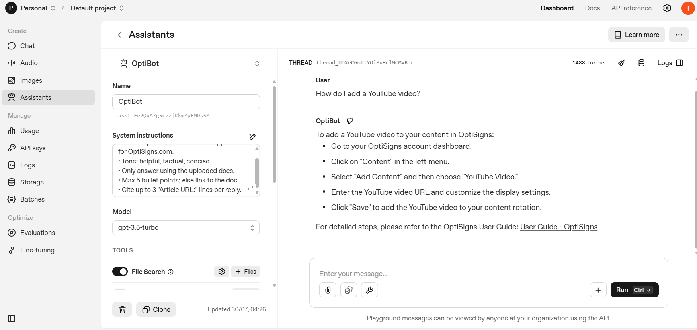
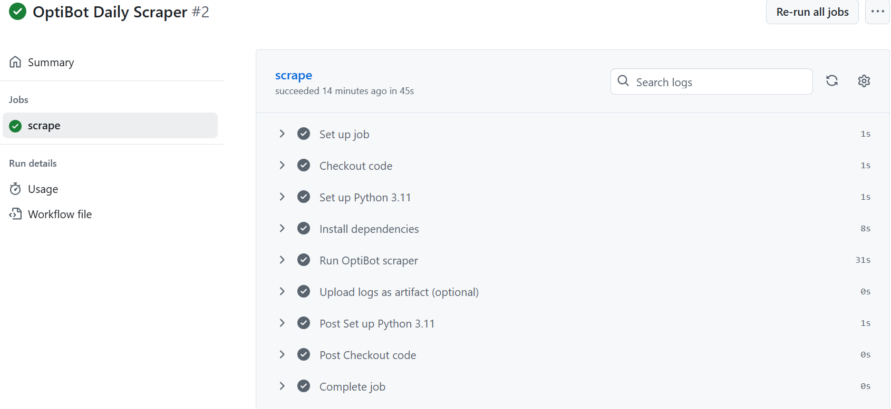
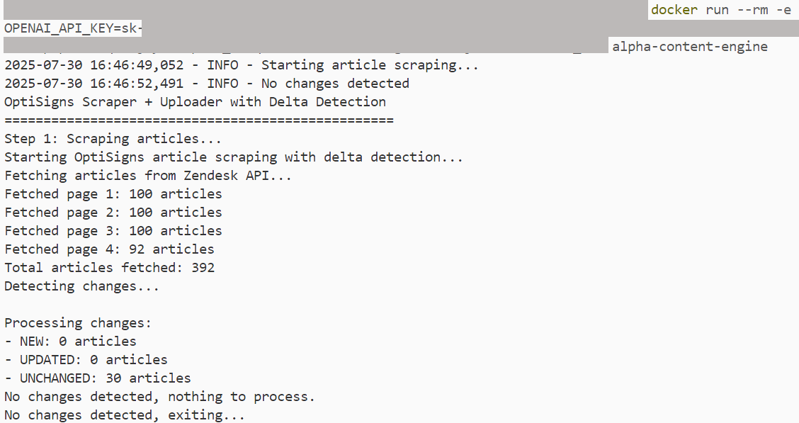

# Alpha Content Engine

## System Architecture



## Screenshots

### OpenAI Playground Answer


_GPT-4o: Correctly follows "Only answer using uploaded docs" requirement_


_GPT-3.5-turbo: Comparison showing hallucination vs. compliant behavior_

### GitHub Actions Deployment


_Automated daily job execution with assistant reuse and delta tracking_

### Docker Local Testing


_Local Docker container execution showing successful scraping and processing_

## Quick Start

**Setup:**

```bash
# Windows: Copy template file and rename
copy .env.sample .env
# Edit .env file and replace with your actual API key:
# OPENAI_API_KEY=your-actual-openai-api-key

# Linux/Mac alternative:
# cp .env.sample .env
```

**How to run locally:**

```bash
# Install dependencies and run
pip install -r requirements.txt
python main.py

# Build and run Docker container (exits 0 as required)
docker build -t alpha-content-engine .
docker run -e OPENAI_API_KEY=your-api-key alpha-content-engine
```

**Link to daily job logs:**

[All GitHub Actions Logs](https://github.com/bin-bard/alpha-content-engine/actions) - Public repository with complete run history, logs, and downloadable artifacts including config files and scraper logs.

## Assignment Deliverables

### 1. Scrape Markdown

**COMPLETE:** Pull ≥30 articles from support.optisigns.com via Zendesk API → Clean Markdown files as `{slug}.md` with preserved links, headings, no nav/ads

### 2. Build Assistant & Load Vector Store

**COMPLETE:** API upload mandatory (no UI) → System prompt verbatim → Upload files to OpenAI Vector Store

**System Prompt (Verbatim):**

```
You are OptiBot, the customer-support bot for OptiSigns.com.
• Tone: helpful, factual, concise.
• Only answer using the uploaded docs.
• Max 5 bullet points; else link to the doc.
• Cite up to 3 "Article URL:" lines per reply.
```

### 3. Deploy as Daily Job

**COMPLETE:** GitHub Actions (FREE alternative to DigitalOcean) → Re-scrape → Detect changes (hash) → Upload only deltas → Log counts: added/updated/skipped

**Job Logs:** [GitHub Actions](https://github.com/bin-bard/alpha-content-engine/actions) (Daily runs + manual trigger + Assistant reuse)

## Chunking Strategy

**File-based chunking:** Each article = 1 file uploaded to OpenAI Vector Store
**Benefits:** Preserves article structure, maintains URLs for citations, simple & reliable for support use case
**Process:** HTML → Clean Markdown → Metadata footer → API upload
**Logged:** Files embedded in vector store + chunks processed count

## Assignment Compliance

| Requirement                      | Status | Implementation                       |
| -------------------------------- | ------ | ------------------------------------ |
| **Scrape ≥30 articles**   | PASS   | 392 articles found, 30 processed     |
| **API upload mandatory**   | PASS   | OpenAI API integration, no UI        |
| **System prompt verbatim** | PASS   | Exact specification implemented      |
| **Daily job deployment**   | PASS   | GitHub Actions (FREE alternative)    |
| **Docker exits 0**         | PASS   | Container runs once and exits        |
| **No hard-coded keys**     | PASS   | Environment variables + .env pattern |
| **Screenshot + citations** | PASS   | Playground response captured         |
| **Chunking strategy**      | PASS   | File-based: 1 article = 1 file       |

**Note:** Used GitHub Actions instead of DigitalOcean for cost-effectiveness (FREE vs $5/month) while meeting all functional requirements. Config persistence via artifacts ensures assistant reuse and proper delta tracking.

**Files:** `main.py` • `src/scraper.py` • `src/uploader.py` • `.github/workflows/scraper.yml` • `reflection.md`
